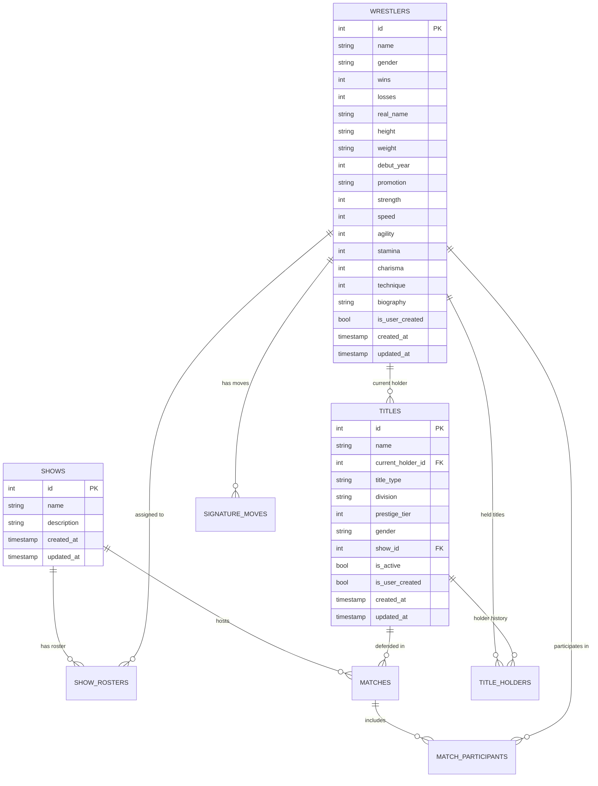

## Overview

WWE Universe Manager uses a sophisticated SQLite database schema designed to handle the complex relationships inherent in professional wrestling management. The schema supports global wrestler and title pools, show-specific rosters, match booking, and comprehensive championship tracking.

## Architecture Principles

<CardGroup cols={2}>
  <Card
    title="Global Resource Model"
    icon="globe"
  >
    Wrestlers and titles are global resources available to all shows, promoting flexibility and realistic storylines
  </Card>
  <Card
    title="Show-Specific Assignments"
    icon="tv"
  >
    Many-to-many relationships allow wrestlers to appear on multiple shows while maintaining roster integrity
  </Card>
  <Card
    title="Comprehensive Tracking"
    icon="chart-line"
  >
    Full historical tracking of title reigns, match results, and roster changes with timestamps
  </Card>
  <Card
    title="Referential Integrity"
    icon="link"
  >
    Foreign key constraints ensure data consistency and prevent orphaned records
  </Card>
</CardGroup>

## Entity Relationship Diagram



## Core Tables

### Shows Table

The foundation table representing wrestling programs and brands.

```sql
CREATE TABLE shows (
    id INTEGER PRIMARY KEY AUTOINCREMENT NOT NULL,
    name TEXT NOT NULL,
    description TEXT NOT NULL,
    created_at TIMESTAMP DEFAULT CURRENT_TIMESTAMP,
    updated_at TIMESTAMP DEFAULT CURRENT_TIMESTAMP
);
```

<Accordion title="Table Details">
**Purpose**: Represents wrestling shows/brands (RAW, SmackDown, NXT, etc.)

**Key Characteristics**:
- Simple structure focusing on show identity
- No promotion hierarchy (simplified from original multi-promotion design)
- Serves as anchor for roster assignments and matches

**Usage Patterns**:
- Referenced by show_rosters for wrestler assignments
- Referenced by matches for show-specific booking
- Referenced by titles for show-specific championship assignments
</Accordion>

### Wrestlers Table

Comprehensive wrestler profiles with enhanced details and power ratings.

```sql
CREATE TABLE wrestlers (
    id INTEGER PRIMARY KEY AUTOINCREMENT NOT NULL,
    name TEXT NOT NULL,
    gender TEXT NOT NULL,
    wins INTEGER NOT NULL DEFAULT 0,
    losses INTEGER NOT NULL DEFAULT 0,
    real_name TEXT,
    nickname TEXT,
    height TEXT,
    weight TEXT,
    debut_year INTEGER,
    promotion TEXT,
    strength INTEGER,
    speed INTEGER, 
    agility INTEGER,
    stamina INTEGER,
    charisma INTEGER,
    technique INTEGER,
    biography TEXT,
    is_user_created BOOLEAN DEFAULT FALSE,
    created_at TIMESTAMP DEFAULT CURRENT_TIMESTAMP,
    updated_at TIMESTAMP DEFAULT CURRENT_TIMESTAMP
);
```

<Accordion title="Table Details">
**Purpose**: Global wrestler pool with comprehensive profiles

**Enhanced Features**:
- **Power Ratings System**: Six attributes (strength, speed, agility, stamina, charisma, technique)
- **Physical Details**: Height, weight, real name, debut year
- **Career Tracking**: Win/loss records, promotion affiliation
- **Biographical Data**: Extensive biography field for character development

**Power Ratings Scale**: 1-100 rating system for each attribute
- **Strength**: Physical power and lifting ability
- **Speed**: Quickness and reaction time  
- **Agility**: Flexibility and acrobatic ability
- **Stamina**: Endurance and conditioning
- **Charisma**: Personality and crowd connection
- **Technique**: Wrestling skill and move execution

**Data Distinction**: `is_user_created` separates test data from user-generated wrestlers
</Accordion>

### Titles Table

Championship management with holder tracking and show assignments.

```sql
CREATE TABLE titles (
    id INTEGER PRIMARY KEY AUTOINCREMENT NOT NULL,
    name TEXT NOT NULL,
    current_holder_id INTEGER REFERENCES wrestlers(id),
    title_type TEXT NOT NULL,
    division TEXT NOT NULL,
    prestige_tier INTEGER NOT NULL,
    gender TEXT NOT NULL,
    show_id INTEGER REFERENCES shows(id),
    is_active BOOLEAN NOT NULL DEFAULT TRUE,
    is_user_created BOOLEAN DEFAULT FALSE,
    created_at TIMESTAMP DEFAULT CURRENT_TIMESTAMP,
    updated_at TIMESTAMP DEFAULT CURRENT_TIMESTAMP
);
```

<Accordion title="Table Details">
**Purpose**: Global championship pool with sophisticated categorization

**Title Classification**:
- **Title Type**: World, Intercontinental, Tag Team, Women's, etc.
- **Division**: Main Event, Mid-Card, Tag Team, Women's, Cruiserweight
- **Prestige Tier**: 1 (World Titles) to 5 (Lower-tier titles)
- **Gender**: Male, Female, Mixed (for intergender competitions)

**Show Assignment**: `show_id` prevents title conflicts between shows
- WWE Championship assigned to RAW
- Universal Championship assigned to SmackDown
- Prevents same title appearing on multiple shows simultaneously

**Current Holder**: Direct reference to current champion with automatic updates
</Accordion>

## Relationship Tables

### Show Rosters Table

Many-to-many wrestler-to-show assignments with historical tracking.

```sql
CREATE TABLE show_rosters (
    id INTEGER PRIMARY KEY AUTOINCREMENT NOT NULL,
    show_id INTEGER NOT NULL REFERENCES shows(id) ON DELETE CASCADE,
    wrestler_id INTEGER NOT NULL REFERENCES wrestlers(id) ON DELETE CASCADE,
    assigned_at TIMESTAMP DEFAULT CURRENT_TIMESTAMP,
    is_active BOOLEAN NOT NULL DEFAULT TRUE,
    UNIQUE(show_id, wrestler_id)
);
```

<Accordion title="Relationship Details">
**Purpose**: Manages wrestler assignments to specific shows

**Key Features**:
- **Unique Constraint**: Prevents duplicate assignments
- **Cascade Deletion**: Automatically cleans up when shows or wrestlers are deleted
- **Historical Tracking**: `assigned_at` timestamp for roster history
- **Active Status**: `is_active` supports roster management without deletion

**Usage in Booking**:
- Booker Dashboard shows only wrestlers assigned to current show
- Prevents cross-show booking conflicts
- Supports storylines spanning multiple shows when wrestler is assigned to both
</Accordion>

### Matches Table

Complete match information with title integration and result tracking.

```sql
CREATE TABLE matches (
    id INTEGER PRIMARY KEY AUTOINCREMENT NOT NULL,
    show_id INTEGER NOT NULL REFERENCES shows(id),
    match_name TEXT,
    match_type TEXT NOT NULL,
    match_stipulation TEXT,
    scheduled_date DATE,
    match_order INTEGER,
    winner_id INTEGER REFERENCES wrestlers(id),
    is_title_match BOOLEAN NOT NULL DEFAULT FALSE,
    title_id INTEGER REFERENCES titles(id),
    created_at TIMESTAMP DEFAULT CURRENT_TIMESTAMP,
    updated_at TIMESTAMP DEFAULT CURRENT_TIMESTAMP
);
```

<Accordion title="Match System Details">
**Purpose**: Comprehensive match booking and result tracking

**Match Organization**:
- **Match Order**: Positions matches within show card (1 = opener, higher = main event)
- **Match Types**: Singles, Tag Team, Triple Threat, Battle Royal, etc.
- **Stipulations**: No DQ, Ladder Match, Hell in a Cell, etc.

**Title Integration**:
- `is_title_match` flag enables championship functionality
- `title_id` links to specific championship
- Winner determination automatically updates title holders

**Result Tracking**:
- `winner_id` records match outcome
- Integrated with statistical updates for wrestlers
- Supports complex booking scenarios and storyline development
</Accordion>

### Match Participants Table

Detailed participant management with team and entrance tracking.

```sql
CREATE TABLE match_participants (
    id INTEGER PRIMARY KEY AUTOINCREMENT NOT NULL,
    match_id INTEGER NOT NULL REFERENCES matches(id),
    wrestler_id INTEGER NOT NULL REFERENCES wrestlers(id),
    team_number INTEGER,
    entrance_order INTEGER
);
```

<Accordion title="Participant System Details">
**Purpose**: Flexible participant management for all match types

**Team Structure**:
- **Singles Matches**: No team assignments (NULL values)
- **Tag Team Matches**: Team 1 and Team 2 assignments
- **Multi-Team**: Support for triple threat tag matches, etc.
- **Faction Wars**: Large team assignments (4v4, 5v5, etc.)

**Entrance Management**:
- **Entrance Order**: Determines wrestler presentation order
- **Championship Protocol**: Champions typically enter last
- **Storyline Enhancement**: Important wrestlers get later entrances
- **Special Events**: Royal Rumble entry numbers, etc.

**Booking Validation**:
- System ensures participants are on show roster
- Prevents duplicate participant entries
- Validates team assignments match match type
</Accordion>

## Historical Tracking Tables

### Title Holders Table

Complete championship history with event details and reign tracking.

```sql
CREATE TABLE title_holders (
    id INTEGER PRIMARY KEY AUTOINCREMENT NOT NULL,
    title_id INTEGER NOT NULL REFERENCES titles(id),
    wrestler_id INTEGER NOT NULL REFERENCES wrestlers(id),
    held_since TIMESTAMP NOT NULL,
    held_until TIMESTAMP,
    event_name TEXT,
    event_location TEXT,
    change_method TEXT,
    created_at TIMESTAMP DEFAULT CURRENT_TIMESTAMP,
    updated_at TIMESTAMP DEFAULT CURRENT_TIMESTAMP
);
```

<Accordion title="Championship History Details">
**Purpose**: Comprehensive title reign tracking with event context

**Reign Management**:
- **Active Reigns**: `held_until` is NULL for current champions
- **Historical Reigns**: Complete start and end timestamps
- **Event Context**: Event name, location, and method of title change
- **Automatic Updates**: System manages reign transitions during match results

**Event Details**:
- **Event Name**: "WrestleMania 40", "Monday Night RAW", etc.
- **Event Location**: "MetLife Stadium", "Allstate Arena", etc.  
- **Change Method**: "Pinfall", "Submission", "Count Out", "DQ", etc.

**Statistical Integration**:
- Supports reign length calculations
- Historical championship statistics
- Title prestige and lineage tracking
</Accordion>

### Signature Moves Table

Wrestler-specific movesets and finishing maneuvers.

```sql
CREATE TABLE signature_moves (
    id INTEGER PRIMARY KEY AUTOINCREMENT,
    wrestler_id INTEGER NOT NULL REFERENCES wrestlers(id),
    move_name TEXT NOT NULL,
    move_type TEXT NOT NULL,
    created_at TIMESTAMP DEFAULT CURRENT_TIMESTAMP,
    updated_at TIMESTAMP DEFAULT CURRENT_TIMESTAMP
);
```

<Accordion title="Moveset System Details">
**Purpose**: Character-specific wrestling moves and finishers

**Move Categories**:
- **Finisher**: Primary finishing move
- **Signature**: Secondary signature moves  
- **Submission**: Submission holds and techniques
- **High Impact**: Power moves and slams
- **Aerial**: High-flying and acrobatic moves

**Character Development**:
- Supports wrestler identity and uniqueness
- Useful for match commentary and descriptions
- Future enhancement for match simulation
- Storyline development through move innovation

**Usage Scenarios**:
- Wrestler profile enhancement
- Match booking considerations
- Storyline development (new finisher debuts)
- Statistical tracking of move effectiveness
</Accordion>

## Authentication and User Management

### Users Table

Basic user authentication and session management.

```sql
CREATE TABLE users (
    id INTEGER PRIMARY KEY AUTOINCREMENT NOT NULL,
    username TEXT NOT NULL UNIQUE,
    password TEXT NOT NULL, -- Argon2 hashed
    created_at TIMESTAMP DEFAULT CURRENT_TIMESTAMP,
    updated_at TIMESTAMP DEFAULT CURRENT_TIMESTAMP
);
```

<Accordion title="Authentication Details">
**Purpose**: Secure user authentication with Argon2 password hashing

**Security Features**:
- **Argon2 Hashing**: Industry-standard password hashing
- **Unique Usernames**: Database constraint prevents duplicates
- **No Plain Text**: Passwords never stored in readable format

**Session Management**:
- Supports multiple user scenarios
- Future enhancement for role-based permissions
- User-specific data isolation capabilities

**Current Implementation**:
- Basic authentication framework
- Ready for multi-user expansion
- Integrated with Tauri authentication commands
</Accordion>

## Database Relationships and Constraints

### Foreign Key Relationships

<Tabs>
  <Tab title="Core Relationships">
    ```sql
    -- Show Rosters
    show_rosters.show_id → shows.id
    show_rosters.wrestler_id → wrestlers.id
    
    -- Matches  
    matches.show_id → shows.id
    matches.winner_id → wrestlers.id
    matches.title_id → titles.id
    
    -- Match Participants
    match_participants.match_id → matches.id
    match_participants.wrestler_id → wrestlers.id
    ```
  </Tab>
  
  <Tab title="Title Relationships">
    ```sql
    -- Current Title Holders
    titles.current_holder_id → wrestlers.id
    titles.show_id → shows.id
    
    -- Title History
    title_holders.title_id → titles.id
    title_holders.wrestler_id → wrestlers.id
    
    -- Signature Moves
    signature_moves.wrestler_id → wrestlers.id
    ```
  </Tab>
</Tabs>

### Unique Constraints

```sql
-- Prevent duplicate roster assignments
UNIQUE(show_id, wrestler_id) ON show_rosters

-- Ensure username uniqueness  
UNIQUE(username) ON users

-- Additional business logic constraints handled at application level
```

### Cascade Behaviors

<AccordionGroup>
  <Accordion title="ON DELETE CASCADE">
    - **Show Rosters**: Deleting show removes all roster assignments
    - **Show Rosters**: Deleting wrestler removes all show assignments
    - Protects against orphaned relationship records
  </Accordion>
  
  <Accordion title="ON DELETE RESTRICT">
    - **Title Holders**: Cannot delete wrestler with active title reign
    - **Match Participants**: Cannot delete wrestler with match bookings
    - Prevents data integrity violations
  </Accordion>
  
  <Accordion title="Application-Level Constraints">
    - Match winners must be participants in the match
    - Title match winners automatically become new champions
    - Show roster assignments required for match booking
  </Accordion>
</AccordionGroup>

## Performance Optimization

### Indexing Strategy

```sql
-- Primary performance indexes
CREATE INDEX idx_show_rosters_show_id ON show_rosters(show_id);
CREATE INDEX idx_show_rosters_wrestler_id ON show_rosters(wrestler_id);  
CREATE INDEX idx_matches_show_id ON matches(show_id);
CREATE INDEX idx_match_participants_match_id ON match_participants(match_id);
CREATE INDEX idx_title_holders_title_id ON title_holders(title_id);
CREATE INDEX idx_titles_current_holder ON titles(current_holder_id);
```

### Query Optimization

<Tabs>
  <Tab title="Roster Queries">
    ```sql
    -- Optimized wrestler roster lookup
    SELECT w.* FROM wrestlers w
    JOIN show_rosters sr ON w.id = sr.wrestler_id  
    WHERE sr.show_id = ? AND sr.is_active = true;
    ```
  </Tab>
  
  <Tab title="Title Queries">
    ```sql
    -- Efficient title with holder lookup
    SELECT t.*, w.name as holder_name 
    FROM titles t
    LEFT JOIN wrestlers w ON t.current_holder_id = w.id
    WHERE t.is_active = true;
    ```
  </Tab>
  
  <Tab title="Match Queries">
    ```sql
    -- Match with participants in single query
    SELECT m.*, mp.wrestler_id, w.name as wrestler_name
    FROM matches m
    JOIN match_participants mp ON m.id = mp.match_id
    JOIN wrestlers w ON mp.wrestler_id = w.id
    WHERE m.show_id = ?
    ORDER BY m.match_order, mp.entrance_order;
    ```
  </Tab>
</Tabs>

## Migration History and Evolution

### Schema Evolution

The database has evolved through several major architectural changes:

<AccordionGroup>
  <Accordion title="Phase 1: Basic CRUD (Initial)">
    - Simple tables for shows, wrestlers, titles, users
    - Basic relationships and constraints
    - Foundation for application functionality
  </Accordion>
  
  <Accordion title="Phase 2: Multi-Promotion Architecture">
    - Added promotions table for multi-tenant support
    - Promotion-scoped wrestlers and titles
    - Complex hierarchy management
  </Accordion>
  
  <Accordion title="Phase 3: Global Resource Model (Current)">
    - Removed promotions table (simplified architecture)
    - Global wrestler and title pools
    - Show roster many-to-many relationships
    - Enhanced match booking system
  </Accordion>
  
  <Accordion title="Phase 4: Enhanced Features">
    - Added power ratings to wrestlers
    - Enhanced title tracking with history
    - Match participants and result tracking
    - Signature moves and character details
  </Accordion>
</AccordionGroup>

### Migration Commands

```bash
# View current schema version
diesel migration list

# Apply all pending migrations  
diesel migration run

# Revert last migration
diesel migration revert

# Generate new migration
diesel migration generate add_new_feature
```

## Future Schema Enhancements

The current schema is designed to support planned advanced features:

<CardGroup cols={2}>
  <Card
    title="Storyline Tracking"
    icon="book-open"
  >
    Tables for storyline management, feuds, and narrative continuity
  </Card>
  <Card
    title="Event Management"
    icon="calendar"
  >
    Pay-per-view events, special shows, and tournament structures
  </Card>
  <Card
    title="Financial System"
    icon="dollar-sign"
  >
    Wrestler contracts, revenue tracking, and budget management
  </Card>
  <Card
    title="Advanced Analytics"
    icon="chart-bar"
  >
    Performance metrics, crowd reactions, and booking analytics
  </Card>
</CardGroup>

The database schema represents a sophisticated foundation for professional wrestling management, balancing complexity with performance while maintaining the flexibility needed for diverse wrestling universe scenarios.