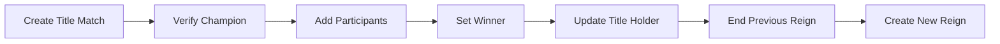
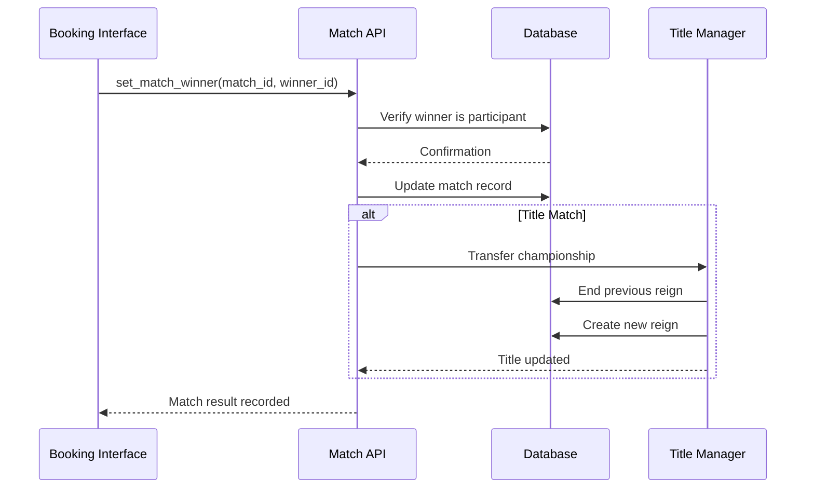

## Overview

WWE Universe Manager's Match Booking System transforms wrestling show planning from simple match listings into sophisticated bout management. Create complex matches with multiple participants, title implications, and detailed result tracking while maintaining roster integrity and storyline continuity.


## Core Features

<CardGroup cols={2}>
  <Card
    title="Match Creation"
    icon="plus-circle"
  >
    Create matches with custom names, types, stipulations, and match order
  </Card>
  <Card
    title="Participant Management"
    icon="users"
  >
    Add multiple wrestlers with team assignments and entrance orders
  </Card>
  <Card
    title="Title Integration"
    icon="trophy"
  >
    Automatic championship tracking with title change management
  </Card>
  <Card
    title="Result Tracking"
    icon="target"
  >
    Set match winners with automatic title holder updates
  </Card>
</CardGroup>

## Match Types and Formats

### Standard Match Types

<Tabs>
  <Tab title="Singles Matches">
    **One-on-one competition**
    - Traditional wrestling match format
    - Two participants only
    - Clear winner determination
    - Perfect for title matches and rivalries
    
    ```rust
    MatchData {
        match_type: "Singles".to_string(),
        participants: 2,
        team_structure: false,
    }
    ```
  </Tab>
  
  <Tab title="Tag Team Matches">
    **Team-based competition**
    - Two teams of two wrestlers each
    - Team number assignments (1 and 2)
    - Entrance order within teams
    - Championship implications for tag titles
    
    ```rust
    // Team 1
    add_wrestler_to_match(match_id, wrestler1_id, Some(1), Some(1)).await?;
    add_wrestler_to_match(match_id, wrestler2_id, Some(1), Some(2)).await?;
    
    // Team 2
    add_wrestler_to_match(match_id, wrestler3_id, Some(2), Some(3)).await?;
    add_wrestler_to_match(match_id, wrestler4_id, Some(2), Some(4)).await?;
    ```
  </Tab>
  
  <Tab title="Multi-Person Matches">
    **Complex multi-wrestler competitions**
    - Triple Threat (3 wrestlers)
    - Fatal Four Way (4 wrestlers)
    - Battle Royal (5+ wrestlers)
    - Custom participant counts
    
    ```rust
    // Triple Threat Example
    add_wrestler_to_match(match_id, wrestler1_id, None, Some(1)).await?;
    add_wrestler_to_match(match_id, wrestler2_id, None, Some(2)).await?;
    add_wrestler_to_match(match_id, wrestler3_id, None, Some(3)).await?;
    ```
  </Tab>
</Tabs>

### Match Stipulations

The system supports various match stipulations that add special rules and conditions:

<AccordionGroup>
  <Accordion title="Championship Stipulations">
    - **Title Match**: Championship on the line
    - **Number One Contender**: Winner gets title shot
    - **Unification**: Multiple titles combined
    - **Ladder Match**: Title suspended above ring
  </Accordion>
  
  <Accordion title="Special Rules">
    - **No Disqualification**: No rules disqualifications
    - **No Holds Barred**: Weapons allowed
    - **Submission Match**: Victory only by submission
    - **Last Man Standing**: 10-count knockout victory
  </Accordion>
  
  <Accordion title="Gimmick Matches">
    - **Cage Match**: Steel cage enclosure
    - **Hell in a Cell**: Cell structure match
    - **Tables Match**: Put opponent through table
    - **Iron Man**: Most falls in time limit
  </Accordion>
  
  <Accordion title="Career Implications">
    - **Loser Leaves Town**: Loser removed from roster
    - **Hair vs Hair**: Loser gets head shaved
    - **Retirement Match**: Loser must retire
    - **Contract Match**: Employment on the line
  </Accordion>
</AccordionGroup>

## Title Match Integration

### Automatic Title Tracking

When creating title matches, the system automatically handles championship logistics:



### Championship Match Creation

<CodeGroup>

```rust Match Setup
let match_data = MatchData {
    show_id: 1,
    match_name: Some("WWE Championship Match".to_string()),
    match_type: "Singles".to_string(),
    match_stipulation: Some("Title Match".to_string()),
    is_title_match: true,
    title_id: Some(1), // WWE Championship
    match_order: Some(1), // Main event
    scheduled_date: None,
};

let match_obj = create_match(match_data).await?;
```

```rust Participant Assignment
// Add current champion
add_wrestler_to_match(
    match_obj.id, 
    current_champion_id, 
    None, 
    Some(1)
).await?;

// Add challenger
add_wrestler_to_match(
    match_obj.id, 
    challenger_id, 
    None, 
    Some(2) 
).await?;
```

```rust Result Processing
// Set match winner (new champion)
set_match_winner(match_obj.id, challenger_id).await?;

// Title automatically transfers to winner
// Previous champion's reign ends
// New reign begins with event details
```

</CodeGroup>

### Multi-Title Scenarios

For complex championship scenarios involving multiple titles:

```rust
// Unification Match - Winner Takes All
let match_data = MatchData {
    match_name: Some("Unification Match".to_string()),
    match_stipulation: Some("Winner Takes All".to_string()),
    is_title_match: true,
    title_id: Some(1), // Primary title
    // Additional titles handled through custom logic
};
```

## Roster Integration

### Show-Specific Booking

The match booking system integrates seamlessly with show rosters:

<Tabs>
  <Tab title="Roster Filtering">
    ```rust
    // Only wrestlers assigned to the show can be booked
    let available_wrestlers = get_wrestlers_for_show(show_id).await?;
    
    // Booking validation prevents cross-show conflicts
    match add_wrestler_to_match(match_id, wrestler_id, None, None).await {
        Ok(participant) => log::info!("Wrestler added to match"),
        Err(e) => log::error!("Booking conflict: {}", e),
    }
    ```
  </Tab>
  
  <Tab title="Availability Checking">
    ```rust
    // System prevents double-booking wrestlers
    pub fn check_wrestler_availability(
        wrestler_id: i32, 
        show_id: i32
    ) -> Result<bool, String> {
        // Check if wrestler is already booked on this show
        // Verify wrestler is assigned to show roster
        // Confirm no conflicting commitments
    }
    ```
  </Tab>
  
  <Tab title="Cross-Brand Exceptions">
    ```rust
    // Special cross-brand matches (with proper roster assignments)
    assign_wrestler_to_show(raw_show_id, smackdown_wrestler_id).await?;
    
    // Now can book cross-brand match
    let match_data = MatchData {
        match_stipulation: Some("Cross-Brand Challenge".to_string()),
        // ... other fields
    };
    ```
  </Tab>
</Tabs>

## Advanced Match Features

### Team Management

For tag team and faction matches, the system provides sophisticated team organization:

```rust
// Create Survivor Series Match (4v4)
let match_data = MatchData {
    match_type: "Survivor Series".to_string(),
    match_stipulation: Some("4-on-4 Elimination".to_string()),
};

let match_obj = create_match(match_data).await?;

// Team RAW
add_wrestler_to_match(match_obj.id, wrestler1_id, Some(1), Some(1)).await?;
add_wrestler_to_match(match_obj.id, wrestler2_id, Some(1), Some(2)).await?;
add_wrestler_to_match(match_obj.id, wrestler3_id, Some(1), Some(3)).await?;
add_wrestler_to_match(match_obj.id, wrestler4_id, Some(1), Some(4)).await?;

// Team SmackDown
add_wrestler_to_match(match_obj.id, wrestler5_id, Some(2), Some(5)).await?;
add_wrestler_to_match(match_obj.id, wrestler6_id, Some(2), Some(6)).await?;
add_wrestler_to_match(match_obj.id, wrestler7_id, Some(2), Some(7)).await?;
add_wrestler_to_match(match_obj.id, wrestler8_id, Some(2), Some(8)).await?;
```

### Entrance Order Significance

The entrance order system supports realistic match presentation:

- **Lower numbers**: Earlier entrances (less important)
- **Higher numbers**: Later entrances (more important)
- **Championship matches**: Champion typically enters last
- **Special attractions**: Main event participants enter last

```rust
// Royal Rumble Entry Example
for (i, wrestler_id) in rumble_participants.iter().enumerate() {
    add_wrestler_to_match(
        rumble_match_id, 
        *wrestler_id, 
        None, 
        Some(i as i32 + 1) // Entry number
    ).await?;
}
```

## Match Card Organization

### Card Structure

Organize matches within shows using the match order system:

<Tabs>
  <Tab title="Traditional Card">
    ```rust
    // Opening Match
    create_match_with_order(show_id, "Tag Team Match", 1).await?;
    
    // Mid-card
    create_match_with_order(show_id, "Women's Championship", 3).await?;
    
    // Semi-Main Event  
    create_match_with_order(show_id, "Intercontinental Title", 4).await?;
    
    // Main Event
    create_match_with_order(show_id, "WWE Championship", 5).await?;
    ```
  </Tab>
  
  <Tab title="Special Event Card">
    ```rust
    // WrestleMania-style card with multiple main events
    create_match_with_order(show_id, "Battle Royal", 1).await?;
    create_match_with_order(show_id, "Women's Title", 2).await?;
    create_match_with_order(show_id, "Tag Team Titles", 3).await?;
    create_match_with_order(show_id, "Intercontinental Title", 4).await?;
    create_match_with_order(show_id, "World Heavyweight Title", 5).await?;
    create_match_with_order(show_id, "WWE Championship", 6).await?; // True main event
    ```
  </Tab>
</Tabs>

### Dynamic Card Management

```rust
// Reorder matches during show planning
pub async fn reorder_match_card(
    show_id: i32, 
    new_order: Vec<(i32, i32)> // (match_id, new_order)
) -> Result<(), String> {
    for (match_id, order) in new_order {
        update_match_order(match_id, order).await?;
    }
    Ok(())
}
```

## Result Management

### Winner Determination

Setting match winners triggers multiple system updates:



### Statistical Updates

Winner determination automatically updates wrestler statistics:

```rust
// Automatic stat updates when setting winner
pub async fn set_match_winner_with_stats(
    match_id: i32, 
    winner_id: i32
) -> Result<Match, String> {
    // Set match winner
    let updated_match = set_match_winner(match_id, winner_id).await?;
    
    // Update winner's record
    increment_wrestler_wins(winner_id).await?;
    
    // Update losers' records
    let participants = get_match_participants(match_id).await?;
    for participant in participants {
        if participant.wrestler_id != winner_id {
            increment_wrestler_losses(participant.wrestler_id).await?;
        }
    }
    
    Ok(updated_match)
}
```

## Booker Dashboard Integration

### Streamlined Workflow

The Booker Dashboard provides a unified interface for match booking:

1. **Show Selection**: Choose which show to book matches for
2. **Roster Review**: See available wrestlers assigned to the show
3. **Match Creation**: Create matches with integrated participant selection
4. **Card Organization**: Arrange matches in logical order
5. **Result Entry**: Set winners and update championship status

### Real-Time Validation

The booking interface provides immediate feedback:

<AccordionGroup>
  <Accordion title="Roster Validation">
    Only wrestlers assigned to the current show appear in participant selection
  </Accordion>
  <Accordion title="Availability Checking">
    System prevents booking wrestlers in overlapping matches
  </Accordion>
  <Accordion title="Title Verification">
    Championship matches verify current holder and title availability
  </Accordion>
  <Accordion title="Participant Limits">
    Match types enforce appropriate participant counts
  </Accordion>
</AccordionGroup>

## Error Handling and Validation

### Common Error Scenarios

<Tabs>
  <Tab title="Booking Conflicts">
    ```rust
    // Wrestler already in another match on same show
    Err("Wrestler John Cena is already booked in match 3 on this show")
    
    // Wrestler not on show roster
    Err("Wrestler Brock Lesnar is not assigned to Monday Night RAW roster")
    
    // Title not available for show
    Err("WWE Championship is assigned to SmackDown, not RAW")
    ```
  </Tab>
  
  <Tab title="Data Validation">
    ```rust
    // Invalid match type
    Err("Match type 'Pillow Fight' is not supported")
    
    // Missing required fields
    Err("Title matches must specify title_id")
    
    // Invalid participant configuration
    Err("Tag team matches require exactly 4 participants")
    ```
  </Tab>
  
  <Tab title="System Constraints">
    ```rust
    // Database constraints
    Err("Cannot set winner: wrestler is not a participant in this match")
    
    // Business logic violations
    Err("Cannot create title match: specified title is currently vacant")
    
    // Resource limitations
    Err("Show already has maximum number of matches (10)")
    ```
  </Tab>
</Tabs>

## Performance Optimization

### Efficient Data Loading

The match booking system is optimized for responsive performance:

```rust
// Batch loading for match creation interface
pub async fn load_booking_data(show_id: i32) -> Result<BookingData, String> {
    let (show, roster, titles, existing_matches) = tokio::try_join!(
        get_show(show_id),
        get_wrestlers_for_show(show_id),
        get_titles_for_show(show_id),
        get_matches_for_show(show_id)
    )?;
    
    Ok(BookingData {
        show,
        available_wrestlers: roster,
        available_titles: titles,
        current_matches: existing_matches,
    })
}
```

### Database Optimization

- **Connection Pooling**: r2d2 manages database connections efficiently
- **Batch Operations**: Multiple participants added in single transaction
- **Indexed Queries**: Fast lookups by show_id, wrestler_id, and match_id
- **Prepared Statements**: Reduced query compilation overhead

## Future Enhancements

The match booking system is designed to support advanced features:

<CardGroup cols={2}>
  <Card
    title="Automated Booking"
    icon="robot"
  >
    AI-driven match suggestions based on wrestler relationships and storylines
  </Card>
  <Card
    title="Storyline Integration"
    icon="book-open"
  >
    Match creation integrated with ongoing narrative management
  </Card>
  <Card
    title="Tournament Brackets"
    icon="tournament"
  >
    Automated tournament creation with bracket progression
  </Card>
  <Card
    title="Historical Analytics"
    icon="chart-bar"
  >
    Match performance analysis and booking optimization insights
  </Card>
</CardGroup>

The Match Booking System transforms WWE Universe Manager from a simple roster tool into a comprehensive wrestling promotion management platform, providing the depth and sophistication needed for serious wrestling universe creation and management.