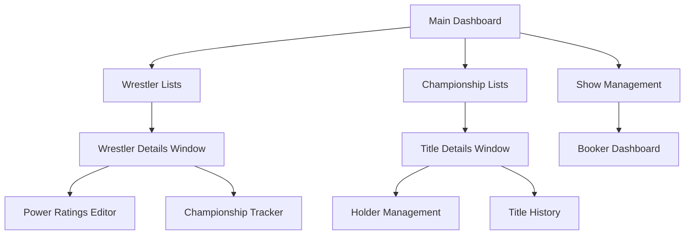
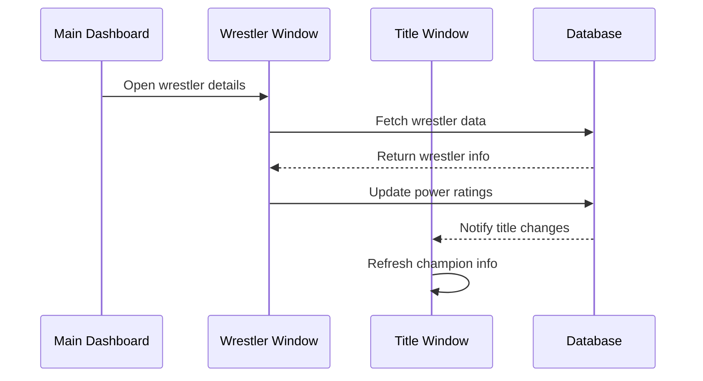

## Overview

WWE Universe Manager features a sophisticated multi-window interface that transforms wrestling management into a professional desktop experience. Each major component opens in its own native window, allowing for simultaneous access to wrestler details, championship management, and show information.


## Key Features

<CardGroup cols={2}>
  <Card
    title="Native Desktop Windows"
    icon="window-restore"
  >
    Each window is a true native desktop window with OS-level controls and behavior
  </Card>
  <Card
    title="State Preservation"
    icon="bookmark"
  >
    Windows remember their content and state across sessions through URL-based routing
  </Card>
  <Card
    title="Single Instance Management"
    icon="layer-group"
  >
    Prevents duplicate windows while allowing easy navigation between different entities
  </Card>
  <Card
    title="Real-Time Synchronization"
    icon="sync"
  >
    Changes in one window are immediately reflected in all other open windows
  </Card>
</CardGroup>

## Window Types

### Wrestler Details Window

The Wrestler Details Window provides comprehensive wrestler management:

<Accordion title="Features">
- **Enhanced Profile Management**: Edit name, real name, biography, and physical stats
- **Power Ratings System**: Adjust strength, speed, agility, stamina, charisma, and technique ratings
- **Championship History**: View and manage all titles held by the wrestler
- **Statistical Tracking**: Win/loss records and career milestones
- **Real-Time Updates**: Changes are instantly saved and reflected across the application
</Accordion>

**Window Specifications:**
- **Size**: 885px × 860px
- **State**: Preserved via URL (`#wrestler?id=1`)
- **Access**: Click "View Details" from any wrestler list

### Title Details Window

The Title Details Window offers complete championship management:

<Accordion title="Features">
- **Current Champion Information**: Display current holder with reign details
- **Championship History**: Complete title holder timeline with event details
- **Title Management Actions**: Change champions, vacate titles, and set prestige tiers
- **Holder Statistics**: Win/loss records and career achievements of current champion
- **Event Integration**: Link title changes to specific shows and events
</Accordion>

**Window Specifications:**
- **Size**: 885px × 860px  
- **State**: Preserved via URL (`#title?id=1`)
- **Access**: Click "Manage Title" from championship lists

## Workflow Integration

### Dashboard-Centric Design

The main dashboard serves as the central hub:



### Simultaneous Multi-Window Usage

Users can efficiently manage their wrestling universe with multiple windows:

1. **Main Dashboard**: Select current show and access management tools
2. **Wrestler Window**: Edit wrestler profiles and power ratings
3. **Title Window**: Manage championship holders and history
4. **Booker Dashboard**: Book matches with show-specific rosters

### Cross-Window Data Flow



## Technical Implementation

### URL-Based State Management

Each window maintains its state through sophisticated URL routing:

```typescript
// Window state preservation
const wrestlerWindow = {
  url: "index.html#wrestler?id=1",
  label: "wrestler-details",
  title: "Wrestler Details"
}

const titleWindow = {
  url: "index.html#title?id=1", 
  label: "title-details",
  title: "Title Details"
}
```

### Single Instance Architecture

The system prevents window proliferation through intelligent window management:

<Tabs>
  <Tab title="Window Creation">
    ```rust
    #[tauri::command]
    async fn open_wrestler_window(app: AppHandle, wrestler_id: Option<String>) -> Result<(), String> {
        let window_label = "wrestler-details";
        
        // Check if window already exists
        if let Some(existing) = app.get_webview_window(window_label) {
            existing.set_focus()?;
            return Ok(());
        }
        
        // Create new window
        let url = format!("index.html#wrestler?id={}", wrestler_id.unwrap_or_default());
        tauri::WebviewWindowBuilder::new(&app, window_label, tauri::WebviewUrl::App(url.into()))
            .title("Wrestler Details")
            .inner_size(885.0, 860.0)
            .build()?;
            
        Ok(())
    }
    ```
  </Tab>
  <Tab title="State Detection">
    ```rust
    // Frontend component routing
    let is_wrestler_window = use_memo(move |_| {
        web_sys::window()
            .unwrap()
            .location()
            .hash()
            .unwrap_or_default()
            .contains("#wrestler")
    });
    
    let wrestler_id = use_memo(move |_| {
        extract_id_from_url()
    });
    ```
  </Tab>
</Tabs>

### Real-Time Synchronization

Changes are synchronized across all windows through reactive state management:

```rust
// Leptos reactive signals ensure real-time updates
let (wrestler, set_wrestler) = create_signal(None::<Wrestler>);

// Update propagates to all components using this wrestler
Effect::new(move |_| {
    if let Some(w) = wrestler.get() {
        // All windows displaying this wrestler will update
        log::info!("Wrestler updated: {}", w.name);
    }
});
```

## User Experience Benefits

### Professional Wrestling Management

The multi-window interface transforms casual roster management into professional wrestling promotion administration:

- **Simultaneous Access**: View wrestler stats while managing championship rosters
- **Contextual Information**: Keep relevant windows open during complex booking decisions
- **Efficient Workflow**: Minimize clicking and navigation between different areas

### Enhanced Productivity

<AccordionGroup>
  <Accordion title="Streamlined Editing">
    Edit multiple wrestlers or titles simultaneously without losing context or progress
  </Accordion>
  <Accordion title="Comparison Capabilities">
    Compare wrestler stats, championship histories, or show rosters side-by-side
  </Accordion>
  <Accordion title="Non-Blocking Operations">
    Long-running operations in one window don't prevent access to other features
  </Accordion>
  <Accordion title="Natural Desktop Behavior">
    Windows behave like native desktop applications with proper focus management
  </Accordion>
</AccordionGroup>

### Memory and Performance

The multi-window system is designed for efficiency:

- **Single Instance Prevention**: Eliminates memory waste from duplicate windows
- **Rust Memory Safety**: Automatic cleanup prevents memory leaks
- **Efficient Rendering**: Only visible windows consume rendering resources
- **State Persistence**: Minimal memory overhead for state preservation

## Usage Scenarios

### Championship Management Workflow

1. **Open Main Dashboard**: View current championship landscape
2. **Open Title Window**: Select specific championship for management
3. **Open Wrestler Window**: Review challenger statistics and qualifications
4. **Make Booking Decision**: Use information from both windows to book title match
5. **Update Results**: Set match winner and automatically update championship history

### Roster Development Session

1. **Open Multiple Wrestler Windows**: Compare different wrestlers' power ratings
2. **Analyze Performance Gaps**: Identify areas for character development
3. **Update Power Ratings**: Adjust multiple wrestlers based on storyline progression
4. **Cross-Reference Titles**: Check which wrestlers are ready for championship pushes

### Show Planning Meeting

1. **Main Dashboard**: Select show for planning session
2. **Roster Window**: Review available wrestlers for the show
3. **Multiple Wrestler Windows**: Research individual wrestlers for storyline potential
4. **Title Windows**: Check championship pictures for potential title matches

## Keyboard Shortcuts and Accessibility

### Window Navigation
- **Alt + Tab**: Standard OS window switching between WWE Universe Manager windows
- **Ctrl + W**: Close current window (returns to main dashboard)
- **F11**: Fullscreen toggle for focused window

### Accessibility Features
- **Screen Reader Support**: All windows properly announce content changes
- **High Contrast Mode**: WWE theme adapts to OS accessibility settings
- **Keyboard Navigation**: Full functionality available without mouse

## Future Enhancements

The multi-window architecture supports planned advanced features:

<CardGroup cols={2}>
  <Card
    title="Draft Window"
    icon="shuffle"
  >
    Interactive draft interface for roster trades and selections
  </Card>
  <Card
    title="Statistics Dashboard"
    icon="chart-line"
  >
    Performance analytics and reporting in dedicated window
  </Card>
  <Card
    title="Match Booking Hub"
    icon="calendar"
  >
    Comprehensive match creation and scheduling interface
  </Card>
  <Card
    title="Storyline Tracker"
    icon="route"
  >
    Narrative management and continuity tracking system
  </Card>
</CardGroup>

## Troubleshooting

### Common Issues

<AccordionGroup>
  <Accordion title="Window Won't Open">
    - Check if window is already open (look for existing window)
    - Restart application if window state becomes corrupted
    - Verify sufficient system memory for new windows
  </Accordion>
  <Accordion title="Content Not Loading">
    - Ensure database connection is active
    - Check network connectivity for any cloud features
    - Refresh window content with Ctrl+R
  </Accordion>
  <Accordion title="State Not Preserved">
    - Verify URL contains proper ID parameter
    - Check browser local storage permissions
    - Reset window state by closing and reopening
  </Accordion>
</AccordionGroup>

The multi-window interface represents the evolution of wrestling management software from simple database applications to professional-grade desktop tools that match the complexity and depth of modern wrestling promotion management.