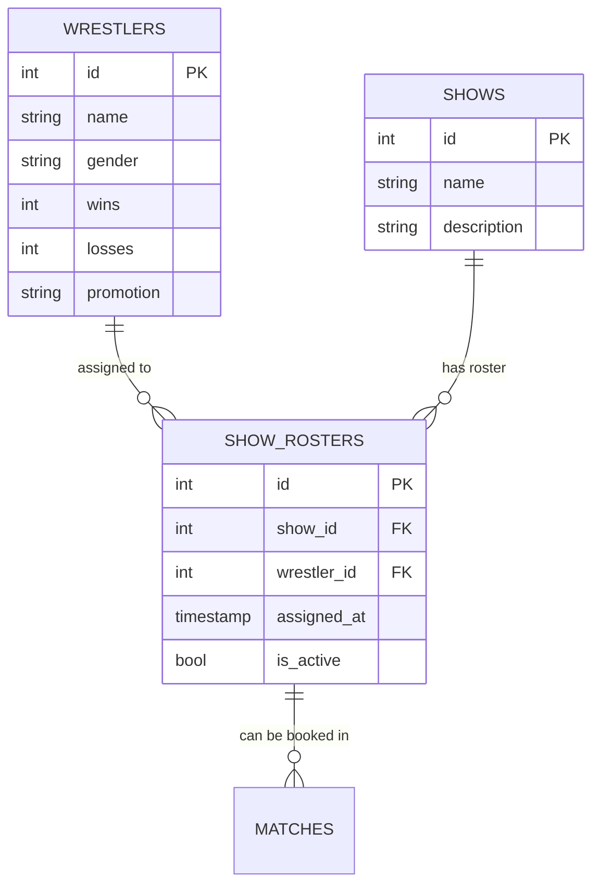

## Overview

Show Roster Management is the backbone of WWE Universe Manager's flexible wrestling promotion system. Unlike traditional roster locks, this system allows wrestlers from the global pool to be assigned to multiple shows, enabling cross-brand storylines while maintaining booking integrity and preventing conflicts.


## Core Concepts

<CardGroup cols={2}>
  <Card
    title="Global Wrestler Pool"
    icon="globe"
  >
    All wrestlers exist in a shared global pool, available for assignment to any show
  </Card>
  <Card
    title="Many-to-Many Assignments"
    icon="arrows-split-up-and-left"
  >
    Wrestlers can be assigned to multiple shows simultaneously for complex storylines
  </Card>
  <Card
    title="Booking Integrity"
    icon="shield-check"
  >
    Only assigned wrestlers can be booked for matches on specific shows
  </Card>
  <Card
    title="Flexible Management"
    icon="sliders"
  >
    Easy assignment, removal, and transfer of wrestlers between shows
  </Card>
</CardGroup>

## Architecture Model

### Database Relationship

The show roster system uses a sophisticated many-to-many relationship:



### Unique Constraints

The system prevents duplicate assignments while allowing flexible management:

```sql
-- Prevents same wrestler being assigned to same show twice
UNIQUE(show_id, wrestler_id) ON show_rosters

-- Cascade deletion maintains referential integrity
ON DELETE CASCADE for both show_id and wrestler_id
```

## Roster Assignment Interface

### Show-Specific Roster View

Each show displays its current roster with management options:

```rust
#[component]
pub fn ShowRosterManagement(show_id: ReadSignal<Option<i32>>) -> impl IntoView {
    let (current_roster, set_current_roster) = create_signal(Vec::<Wrestler>::new());
    let (available_wrestlers, set_available_wrestlers) = create_signal(Vec::<Wrestler>::new());
    let (loading, set_loading) = create_signal(false);
    
    // Load current roster when show changes
    Effect::new(move |_| {
        if let Some(id) = show_id.get() {
            set_loading.set(true);
            spawn_local(async move {
                match get_wrestlers_for_show(id).await {
                    Ok(roster) => set_current_roster.set(roster),
                    Err(e) => log::error!("Failed to load roster: {}", e),
                }
                set_loading.set(false);
            });
        }
    });
    
    // Load available wrestlers (not on current roster)
    Effect::new(move |_| {
        if show_id.get().is_some() {
            spawn_local(async move {
                let all_wrestlers = get_wrestlers().await.unwrap_or_default();
                let roster_ids: HashSet<i32> = current_roster.get()
                    .iter()
                    .map(|w| w.id)
                    .collect();
                    
                let available: Vec<Wrestler> = all_wrestlers
                    .into_iter()
                    .filter(|w| !roster_ids.contains(&w.id))
                    .collect();
                    
                set_available_wrestlers.set(available);
            });
        }
    });
    
    view! {
        <div class="space-y-6">
            <CurrentRosterSection 
                roster=current_roster
                show_id=show_id
                on_roster_change=move |_| {
                    // Trigger reload of both rosters
                    if let Some(id) = show_id.get() {
                        spawn_local(async move {
                            if let Ok(roster) = get_wrestlers_for_show(id).await {
                                set_current_roster.set(roster);
                            }
                        });
                    }
                }
            />
            
            <AvailableWrestlersSection
                available_wrestlers=available_wrestlers
                show_id=show_id
                on_assignment=move |_| {
                    // Trigger roster reload
                }
            />
        </div>
    }
}
```

### Current Roster Display

Shows all wrestlers currently assigned to the selected show:

```rust
#[component]
pub fn CurrentRosterSection(
    roster: ReadSignal<Vec<Wrestler>>,
    show_id: ReadSignal<Option<i32>>,
    on_roster_change: impl Fn(()) + 'static,
) -> impl IntoView {
    let remove_wrestler = move |wrestler_id: i32| {
        if let Some(id) = show_id.get() {
            spawn_local(async move {
                match remove_wrestler_from_show(id, wrestler_id).await {
                    Ok(_) => {
                        log::info!("Wrestler removed from roster");
                        on_roster_change(());
                    }
                    Err(e) => log::error!("Failed to remove wrestler: {}", e),
                }
            });
        }
    };
    
    view! {
        <div class="bg-slate-800 rounded-lg p-6">
            <div class="flex justify-between items-center mb-4">
                <h3 class="text-xl font-bold text-yellow-400">
                    "Current Roster (" {move || roster.get().len()} " wrestlers)"
                </h3>
                <div class="text-sm text-slate-400">
                    "Active roster members available for booking"
                </div>
            </div>
            
            <Show 
                when=move || !roster.get().is_empty()
                fallback=|| view! {
                    <div class="text-center py-8 text-slate-400">
                        <p>"No wrestlers assigned to this show yet."</p>
                        <p class="text-sm mt-1">"Use the section below to add wrestlers to the roster."</p>
                    </div>
                }
            >
                <div class="grid grid-cols-1 md:grid-cols-2 lg:grid-cols-3 gap-4">
                    <For
                        each=roster
                        key=|wrestler| wrestler.id
                        children=move |wrestler| {
                            let wrestler_id = wrestler.id;
                            view! {
                                <div class="bg-slate-700 rounded-lg p-4 border border-slate-600">
                                    <div class="flex justify-between items-start mb-2">
                                        <div>
                                            <h4 class="font-bold text-lg">{wrestler.name.clone()}</h4>
                                            <p class="text-slate-300 text-sm">
                                                {wrestler.wins} "-" {wrestler.losses}
                                            </p>
                                            <Show when=move || wrestler.promotion.is_some()>
                                                <p class="text-yellow-400 text-xs">
                                                    {wrestler.promotion.clone().unwrap_or_default()}
                                                </p>
                                            </Show>
                                        </div>
                                        <button
                                            on:click=move |_| remove_wrestler(wrestler_id)
                                            class="btn btn-sm btn-error btn-outline"
                                            title="Remove from roster"
                                        >
                                            "Remove"
                                        </button>
                                    </div>
                                    
                                    // Power ratings display
                                    <div class="grid grid-cols-2 gap-2 text-xs mt-3">
                                        <div class="flex justify-between">
                                            <span>"STR:"</span>
                                            <span class="font-bold">{wrestler.strength.unwrap_or(50)}</span>
                                        </div>
                                        <div class="flex justify-between">
                                            <span>"SPD:"</span>
                                            <span class="font-bold">{wrestler.speed.unwrap_or(50)}</span>
                                        </div>
                                        <div class="flex justify-between">
                                            <span>"AGI:"</span>
                                            <span class="font-bold">{wrestler.agility.unwrap_or(50)}</span>
                                        </div>
                                        <div class="flex justify-between">
                                            <span>"CHA:"</span>
                                            <span class="font-bold">{wrestler.charisma.unwrap_or(50)}</span>
                                        </div>
                                    </div>
                                </div>
                            }
                        }
                    />
                </div>
            </Show>
        </div>
    }
}
```

### Available Wrestlers Pool

Displays wrestlers available for assignment to the current show:

```rust
#[component]
pub fn AvailableWrestlersSection(
    available_wrestlers: ReadSignal<Vec<Wrestler>>,
    show_id: ReadSignal<Option<i32>>,
    on_assignment: impl Fn(()) + 'static,
) -> impl IntoView {
    let (search_filter, set_search_filter) = create_signal(String::new());
    let (gender_filter, set_gender_filter) = create_signal("All".to_string());
    
    let filtered_wrestlers = move || {
        let wrestlers = available_wrestlers.get();
        let search = search_filter.get().to_lowercase();
        let gender = gender_filter.get();
        
        wrestlers.into_iter()
            .filter(|w| {
                let name_match = w.name.to_lowercase().contains(&search);
                let gender_match = gender == "All" || w.gender == gender;
                name_match && gender_match
            })
            .collect::<Vec<_>>()
    };
    
    let assign_wrestler = move |wrestler_id: i32| {
        if let Some(id) = show_id.get() {
            spawn_local(async move {
                match assign_wrestler_to_show(id, wrestler_id).await {
                    Ok(_) => {
                        log::info!("Wrestler assigned to show");
                        on_assignment(());
                    }
                    Err(e) => log::error!("Failed to assign wrestler: {}", e),
                }
            });
        }
    };
    
    view! {
        <div class="bg-slate-800 rounded-lg p-6">
            <div class="flex justify-between items-center mb-4">
                <h3 class="text-xl font-bold text-yellow-400">
                    "Available Wrestlers (" {move || filtered_wrestlers().len()} ")"
                </h3>
            </div>
            
            // Filters
            <div class="flex gap-4 mb-4">
                <input
                    type="text"
                    placeholder="Search wrestlers..."
                    prop:value=search_filter
                    on:input=move |ev| set_search_filter.set(event_target_value(&ev))
                    class="input input-bordered flex-1"
                />
                <select
                    prop:value=gender_filter
                    on:change=move |ev| set_gender_filter.set(event_target_value(&ev))
                    class="select select-bordered"
                >
                    <option value="All">"All Genders"</option>
                    <option value="Male">"Male"</option>
                    <option value="Female">"Female"</option>
                </select>
            </div>
            
            <Show 
                when=move || !filtered_wrestlers().is_empty()
                fallback=|| view! {
                    <div class="text-center py-8 text-slate-400">
                        <p>"No available wrestlers match the current filters."</p>
                        <p class="text-sm mt-1">"Try adjusting your search or creating new wrestlers."</p>
                    </div>
                }
            >
                <div class="grid grid-cols-1 md:grid-cols-2 lg:grid-cols-3 gap-4">
                    <For
                        each=filtered_wrestlers
                        key=|wrestler| wrestler.id
                        children=move |wrestler| {
                            let wrestler_id = wrestler.id;
                            view! {
                                <div class="bg-slate-700 rounded-lg p-4 border border-slate-600 hover:border-slate-500 transition-colors">
                                    <div class="flex justify-between items-start mb-2">
                                        <div>
                                            <h4 class="font-bold text-lg">{wrestler.name.clone()}</h4>
                                            <p class="text-slate-300 text-sm">
                                                {wrestler.wins} "-" {wrestler.losses}
                                            </p>
                                            <Show when=move || wrestler.promotion.is_some()>
                                                <p class="text-yellow-400 text-xs">
                                                    {wrestler.promotion.clone().unwrap_or_default()}
                                                </p>
                                            </Show>
                                        </div>
                                        <button
                                            on:click=move |_| assign_wrestler(wrestler_id)
                                            class="btn btn-sm btn-primary"
                                            title="Add to roster"
                                        >
                                            "Add"
                                        </button>
                                    </div>
                                    
                                    // Overall rating display
                                    <div class="mt-3 text-center">
                                        <div class="text-xs text-slate-400 mb-1">"Overall Rating"</div>
                                        <div class="text-lg font-bold text-yellow-400">
                                            {calculate_overall_rating(&wrestler)}
                                        </div>
                                    </div>
                                </div>
                            }
                        }
                    />
                </div>
            </Show>
        </div>
    }
}
```

## Advanced Roster Features

### Bulk Assignment Operations

For efficient roster management, the system supports bulk operations:

```rust
#[component]
pub fn BulkRosterActions(
    show_id: ReadSignal<Option<i32>>,
    available_wrestlers: ReadSignal<Vec<Wrestler>>,
    on_bulk_change: impl Fn(()) + 'static,
) -> impl IntoView {
    let (selected_wrestlers, set_selected_wrestlers) = create_signal(Vec::<i32>::new());
    
    let assign_selected = move |_| {
        if let Some(id) = show_id.get() {
            let wrestler_ids = selected_wrestlers.get();
            spawn_local(async move {
                let mut success_count = 0;
                for wrestler_id in wrestler_ids {
                    if assign_wrestler_to_show(id, wrestler_id).await.is_ok() {
                        success_count += 1;
                    }
                }
                log::info!("Assigned {} wrestlers to show", success_count);
                on_bulk_change(());
            });
            set_selected_wrestlers.set(Vec::new());
        }
    };
    
    let select_by_criteria = move |criteria: &str| {
        let wrestlers = available_wrestlers.get();
        let selected: Vec<i32> = match criteria {
            "high_rated" => wrestlers.iter()
                .filter(|w| calculate_overall_rating(w) >= 75)
                .map(|w| w.id)
                .collect(),
            "male" => wrestlers.iter()
                .filter(|w| w.gender == "Male")
                .map(|w| w.id)
                .collect(),
            "female" => wrestlers.iter()
                .filter(|w| w.gender == "Female")
                .map(|w| w.id)
                .collect(),
            "all" => wrestlers.iter().map(|w| w.id).collect(),
            _ => Vec::new(),
        };
        set_selected_wrestlers.set(selected);
    };
    
    view! {
        <div class="bg-slate-700 rounded-lg p-4 mb-4">
            <h4 class="font-semibold mb-3">"Bulk Assignment Tools"</h4>
            
            <div class="flex flex-wrap gap-2 mb-3">
                <button 
                    on:click=move |_| select_by_criteria("high_rated")
                    class="btn btn-sm btn-secondary"
                >
                    "Select High-Rated (75+)"
                </button>
                <button 
                    on:click=move |_| select_by_criteria("male")
                    class="btn btn-sm btn-secondary"
                >
                    "Select All Male"
                </button>
                <button 
                    on:click=move |_| select_by_criteria("female")
                    class="btn btn-sm btn-secondary"
                >
                    "Select All Female"
                </button>
                <button 
                    on:click=move |_| select_by_criteria("all")
                    class="btn btn-sm btn-secondary"
                >
                    "Select All"
                </button>
                <button 
                    on:click=move |_| set_selected_wrestlers.set(Vec::new())
                    class="btn btn-sm btn-outline"
                >
                    "Clear Selection"
                </button>
            </div>
            
            <div class="flex items-center gap-3">
                <span class="text-sm text-slate-300">
                    {move || selected_wrestlers.get().len()} " wrestlers selected"
                </span>
                <button
                    on:click=assign_selected
                    class="btn btn-sm btn-primary"
                    disabled=move || selected_wrestlers.get().is_empty()
                >
                    "Assign Selected to Roster"
                </button>
            </div>
        </div>
    }
}
```

### Cross-Brand Assignment Tracking

The system tracks wrestlers assigned to multiple shows:

```rust
#[component]
pub fn CrossBrandTracker(wrestler_id: i32) -> impl IntoView {
    let (assigned_shows, set_assigned_shows) = create_signal(Vec::<Show>::new());
    
    Effect::new(move |_| {
        spawn_local(async move {
            // Custom API call to get all shows a wrestler is assigned to
            match get_shows_for_wrestler(wrestler_id).await {
                Ok(shows) => set_assigned_shows.set(shows),
                Err(e) => log::error!("Failed to load wrestler shows: {}", e),
            }
        });
    });
    
    view! {
        <div class="mt-3">
            <h5 class="text-sm font-semibold mb-2">"Assigned to Shows:"</h5>
            <div class="flex flex-wrap gap-1">
                <For
                    each=assigned_shows
                    key=|show| show.id
                    children=move |show| view! {
                        <span class="bg-yellow-600 text-black px-2 py-1 rounded text-xs font-medium">
                            {show.name.clone()}
                        </span>
                    }
                />
            </div>
            <Show when=move || assigned_shows.get().len() > 1>
                <div class="text-xs text-orange-400 mt-1">
                    "⚠ Cross-brand wrestler - available for inter-promotional storylines"
                </div>
            </Show>
        </div>
    }
}
```

## Roster Management Strategies

### Brand Split Management

<Tabs>
  <Tab title="Exclusive Rosters">
    **Strategy**: Each show has completely separate rosters
    - **Benefits**: Clear brand identity, no booking conflicts
    - **Implementation**: Assign wrestlers to only one show
    - **Use Cases**: Traditional brand split scenarios
    
    ```rust
    // Ensure exclusive assignment
    pub async fn assign_exclusively(show_id: i32, wrestler_id: i32) -> Result<(), String> {
        // Remove from all other shows first
        let all_shows = get_shows().await?;
        for show in all_shows {
            if show.id != show_id {
                let _ = remove_wrestler_from_show(show.id, wrestler_id).await;
            }
        }
        
        // Then assign to target show
        assign_wrestler_to_show(show_id, wrestler_id).await?;
        Ok(())
    }
    ```
  </Tab>
  
  <Tab title="Shared Superstars">
    **Strategy**: Top stars appear on multiple shows
    - **Benefits**: Cross-promotional storylines, special attractions
    - **Implementation**: Assign select wrestlers to multiple shows
    - **Use Cases**: Part-time legends, special guest appearances
    
    ```rust
    // Multi-show assignment for special attractions
    pub async fn create_special_attraction(wrestler_id: i32) -> Result<(), String> {
        let main_shows = vec![1, 2]; // RAW and SmackDown
        
        for show_id in main_shows {
            assign_wrestler_to_show(show_id, wrestler_id).await?;
        }
        
        Ok(())
    }
    ```
  </Tab>
  
  <Tab title="Floating Roster">
    **Strategy**: Some wrestlers available to all shows
    - **Benefits**: Flexibility for storylines, roster depth
    - **Implementation**: Assign certain wrestlers globally
    - **Use Cases**: Utility players, developmental talent
    
    ```rust
    // Global assignment for utility wrestlers
    pub async fn assign_globally(wrestler_id: i32) -> Result<(), String> {
        let all_shows = get_shows().await?;
        
        for show in all_shows {
            assign_wrestler_to_show(show.id, wrestler_id).await?;
        }
        
        Ok(())
    }
    ```
  </Tab>
</Tabs>

### Roster Balance Considerations

<AccordionGroup>
  <Accordion title="Gender Balance">
    **Goal**: Ensure adequate representation across divisions
    - **Men's Division**: 60-70% of roster for singles/tag competition
    - **Women's Division**: 25-35% for dedicated storylines
    - **Mixed Matches**: Cross-gender storyline opportunities
    
    **Implementation**: Use gender filters in bulk assignment tools
  </Accordion>
  
  <Accordion title="Rating Distribution">
    **Goal**: Balanced mix of skill levels for realistic hierarchies
    - **Main Event (85+)**: 2-4 wrestlers per show
    - **Upper Mid-Card (75-84)**: 6-8 wrestlers per show
    - **Mid-Card (65-74)**: 8-12 wrestlers per show
    - **Lower Card (50-64)**: 6-10 wrestlers per show
    
    **Implementation**: Use rating-based selection criteria
  </Accordion>
  
  <Accordion title="Storyline Considerations">
    **Goal**: Support ongoing and planned storylines
    - **Feuding Wrestlers**: Must be on same show for consistent booking
    - **Stables/Factions**: Keep group members together
    - **Championship Pictures**: Ensure adequate challengers per title
    
    **Implementation**: Manual curation based on narrative needs
  </Accordion>
</AccordionGroup>

## Integration with Match Booking

### Booking Validation

The roster system integrates with match booking to ensure integrity:

```rust
// Match booking validation
pub async fn validate_match_participants(
    show_id: i32, 
    participant_ids: &[i32]
) -> Result<(), String> {
    let show_roster = get_wrestlers_for_show(show_id).await?;
    let roster_ids: HashSet<i32> = show_roster.iter().map(|w| w.id).collect();
    
    for participant_id in participant_ids {
        if !roster_ids.contains(participant_id) {
            let wrestler = get_wrestler_by_id(*participant_id).await?
                .ok_or("Wrestler not found")?;
            return Err(format!(
                "Wrestler '{}' is not assigned to this show's roster. Add them first.",
                wrestler.name
            ));
        }
    }
    
    Ok(())
}
```

### Automatic Roster Suggestions

The system can suggest roster additions based on booking needs:

```rust
pub async fn suggest_roster_additions(
    show_id: i32,
    match_types: &[String]
) -> Result<Vec<Wrestler>, String> {
    let current_roster = get_wrestlers_for_show(show_id).await?;
    let all_wrestlers = get_wrestlers().await?;
    
    // Calculate roster gaps
    let roster_ratings: Vec<i32> = current_roster.iter()
        .map(|w| calculate_overall_rating(w))
        .collect();
    
    let avg_rating = roster_ratings.iter().sum::<i32>() / roster_ratings.len() as i32;
    
    // Suggest wrestlers to fill gaps
    let suggestions: Vec<Wrestler> = all_wrestlers.into_iter()
        .filter(|w| {
            let not_on_roster = !current_roster.iter().any(|r| r.id == w.id);
            let rating_fit = calculate_overall_rating(w) >= avg_rating - 10;
            not_on_roster && rating_fit
        })
        .take(5)
        .collect();
    
    Ok(suggestions)
}
```

## Performance and Scalability

### Efficient Roster Queries

The system is optimized for fast roster operations:

```rust
// Optimized roster loading with single query
pub async fn get_roster_with_stats(show_id: i32) -> Result<Vec<WrestlerWithStats>, String> {
    // Single query with joins to get roster plus statistics
    let query = "
        SELECT w.*, sr.assigned_at, sr.is_active,
               COUNT(mp.id) as match_count,
               SUM(CASE WHEN m.winner_id = w.id THEN 1 ELSE 0 END) as show_wins
        FROM wrestlers w
        JOIN show_rosters sr ON w.id = sr.wrestler_id
        LEFT JOIN match_participants mp ON w.id = mp.wrestler_id
        LEFT JOIN matches m ON mp.match_id = m.id AND m.show_id = ?
        WHERE sr.show_id = ? AND sr.is_active = true
        GROUP BY w.id
        ORDER BY w.name
    ";
    
    // Execute query and return results
    // Implementation details...
}
```

### Caching Strategy

For frequently accessed roster data:

```rust
// Implement roster caching for performance
use std::collections::HashMap;
use std::sync::{Arc, RwLock};

#[derive(Clone)]
pub struct RosterCache {
    cache: Arc<RwLock<HashMap<i32, Vec<Wrestler>>>>,
}

impl RosterCache {
    pub fn new() -> Self {
        Self {
            cache: Arc::new(RwLock::new(HashMap::new())),
        }
    }
    
    pub async fn get_roster(&self, show_id: i32) -> Result<Vec<Wrestler>, String> {
        // Check cache first
        if let Ok(cache) = self.cache.read() {
            if let Some(roster) = cache.get(&show_id) {
                return Ok(roster.clone());
            }
        }
        
        // Load from database and cache
        let roster = get_wrestlers_for_show(show_id).await?;
        
        if let Ok(mut cache) = self.cache.write() {
            cache.insert(show_id, roster.clone());
        }
        
        Ok(roster)
    }
    
    pub fn invalidate(&self, show_id: i32) {
        if let Ok(mut cache) = self.cache.write() {
            cache.remove(&show_id);
        }
    }
}
```

## Future Enhancements

The show roster system is designed to support advanced features:

<CardGroup cols={2}>
  <Card
    title="Draft System"
    icon="shuffle"
  >
    Automated draft where shows take turns selecting wrestlers from the global pool
  </Card>
  <Card
    title="Roster Limits"
    icon="hashtag"
  >
    Configurable maximum roster sizes per show with overflow management
  </Card>
  <Card
    title="Inactive Status"
    icon="pause"
  >
    Temporarily remove wrestlers from booking without full roster removal
  </Card>
  <Card
    title="Historical Tracking"
    icon="clock"
  >
    Complete history of roster moves, trades, and assignments over time
  </Card>
</CardGroup>

The Show Roster Management system provides the foundation for sophisticated wrestling promotion management, enabling complex storylines while maintaining the booking integrity essential for realistic wrestling universe simulation.